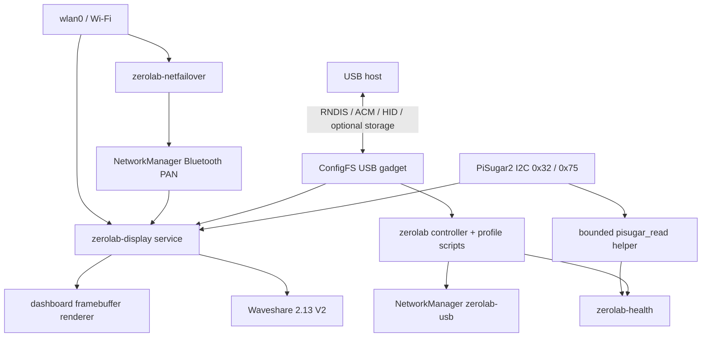

# Architecture

ZeroLab separates USB composition, network failover, health telemetry, and e-paper rendering into independent processes with explicit ownership boundaries.

## USB controller

`controller.py` provides `status`, `profiles`, `up`, and `down`. Profile changes use an exclusive lock at `/run/lock/zerolab.lock`. When switching profiles, the current ConfigFS gadget is fully removed before the next profile is activated. If activation fails, the controller runs the teardown path again so the appliance does not remain in a partially configured gadget state.

## ConfigFS profiles

Profile scripts live in `/usr/local/lib/zerolab/profiles/`. They create `/sys/kernel/config/usb_gadget/zerolab`, add only the requested functions, bind the single UDC, and wait for the expected kernel device nodes/interfaces.

RNDIS functions are linked first in composite profiles to preserve stable Windows interface ordering. The accepted `full` ordering was RNDIS, ACM, HID. `full-storage` adds mass storage last.

## Network ownership

NetworkManager owns Layer 3 on `usb0`; gadget profile scripts create the kernel function and then activate the `zerolab-usb` connection. Wi-Fi and Bluetooth PAN are also managed by NetworkManager.

`zerolab-netfailover` deliberately tests only 802.11 association. Loss of upstream Internet while Wi-Fi remains associated does not trigger Bluetooth fallback.

## Power telemetry

The stateless health command uses a root-owned allowlisted helper that can read only selected PiSugar RTC/PowerIC registers. The display controller performs its own read-only voltage sampling to keep charging-state history across samples.

## Display ownership

The persistent display service is the only process that owns Waveshare GPIO/SPI resources. The dashboard renderer can run in a frame-only mode that uses Pillow without importing the Waveshare hardware module. This separation prevents duplicate GPIO claims.

At service start the panel receives a full base image. Subsequent changes use partial refreshes. After 20 partial updates or six hours, the next update re-establishes a full base image.
